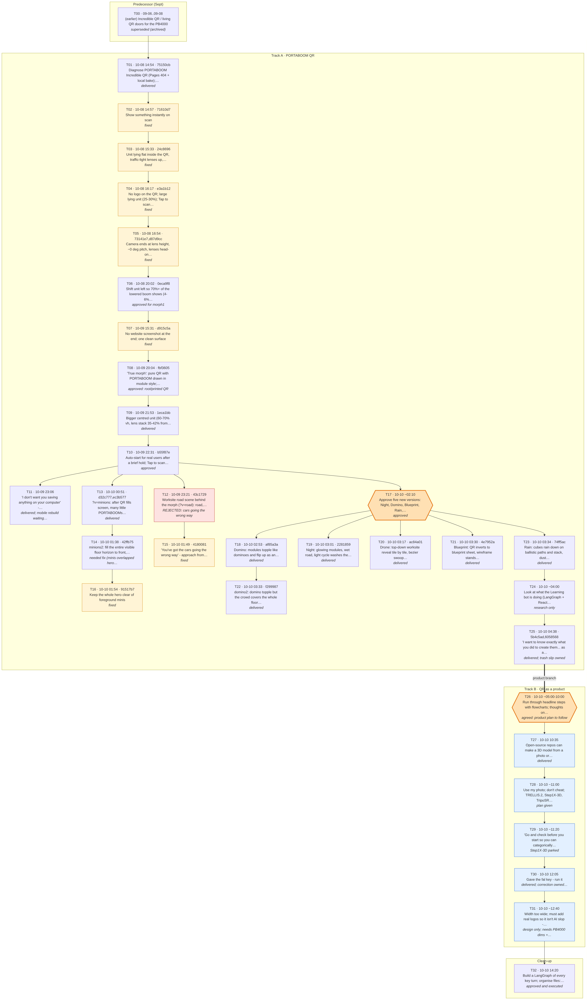

# Key turns of the PORTABOOM QR work (LangGraph)

Every key turn from 2026-10-08 to 2026-10-10 (Sydney time) as a node: Fabian's ask, what was built or changed, the
commits, the Drive artifacts and the outcome. Edges follow the decision lineage. T17 is where the five extra versions
fork off; T26 is where the QR-as-a-product branch (track B, kept private) splits from the PORTABOOM QR work (track A).

| File | What |
|---|---|
| `turns.json` | the 33 turns (T00-T32), generated by `make_turns.py` |
| `graph.py` | LangGraph `StateGraph`: `python graph.py` (all), `python graph.py A` / `B` (one track), `python graph.py lineage T30` |
| `studio_graph.py`, `langgraph.json` | entry points for LangGraph Studio (`langgraph dev` in this folder) |
| `render.py`, `render_png.py` | write `graph.mmd` / `graph_langgraph.mmd` and render the PNGs (needs `mermaid` + Playwright) |

Requirements: `pip install -r requirements.txt`.
